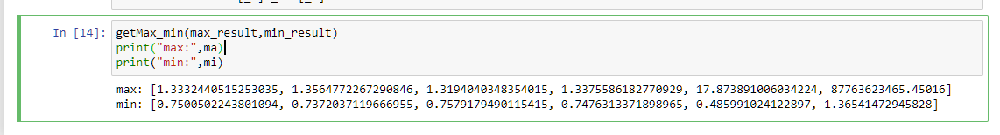

## Heartbeat_Anomalous_Diagnose

#### Project directory structure

The purpose of this project is to analyze the heart rate sequence of each thread generated by OpenMp multithreading and perform abnormality detection. The project directory is shown below. In this experiment, three OpenMp Benchmarks, NPB, Jacobi, and EPCC-array, are used as experimental objects to obtain data sets.

With the following directory structure, this project creates a folder for each Benchmark for better project management. In this folder, there are two parts, training and testing, which are model training and model prediction modules.

<pre>
Heartbeat_Anomalous_Diagnose
│
├── NPB_cg
│   ├── training
│   │   ├── Normal_parameters_training.ipynb
│   │   └── Dataset
│   └── testing
│       ├── NPB_cg_Test.ipynb
│       └── Dataset 
├── NPB-bt
│   └── testing
├── NPB-cg
│   └── testing
├── NPB-lu
│   └── testing
├── EPCC-array
│   └── testing
├── jacobi
│   └── testing
└── readme.md
</pre>


#### Operating environment

**System environment**

| Attributes       | value        |
| ---------------- | ------------ |
| Operating system | ubuntu 16.04 |
|Processor|intel(R) Core(TM) i5-4210H CPU @2.90GHz|
|RAM|8G|

**Note**: In order to control the influencing variables, for different classification tasks, only start the ring heartbeat program and insert the corresponding abnormal program during the experiment, and do not start other additional programs (such as browsers, software) to avoid competition for system resources due to other programs. Affect the real detection process.

**Preconditions**

```
Python 3.6.4
Anaconda 4.4.0
Jupyter 4.4.0
Numpy 1.14.0
Pandas 0.22.0
```


#### Execute program

**Basic Process**

* Open terminal or cmd to enter the code path

```python
cd ./path
```

* Enter jupyter notebook

```python
jupyter notebook
```

* Click on the .ipynb file and enter to view and execute the program in real time with "Ctrl+Enter"


#### DataSet

**Basic information**

| File name                        | Description                                  |
| -------------------------------- | -------------------------------------------- |
| sp\|lu\|cg\|bt_lab_abnormal.xlsx | Heartbeat Sequence set marked as memory leak |
| sp\|lu\|cg\|bt_lab_shutdown.xlsx | Heartbeat Sequence set marked as Shutdown    |
| sp\|lu\|cg\|bt_lab_normal.xlsx   | Heartbeat Sequence set marked as normal      |
| sp\|lu\|cg\|bt_normal.xlsx       | Heartbeat Sequence set for training          |

**File attributes**

| Attributes | Description                                         |
| ---------- | --------------------------------------------------- |
| index      | index                                               |
| thread_num | Thread number                                       |
| iter       | Number of iterations                                |
| time       | Execution time                                      |
| heartrate  | Thread heart rate                                   |
| score      | Mark <br/> (0: normal, 1: memory leak, 2: Shutdown) |
| file       | File identification                                 |


#### Example

This example uses the NPB-cg benchmark data set as an example to briefly introduce the implementation process of this project.

**Training**

Firstly, enter the path ```./NPB-cg/training``` through the ```cd``` instruction in the Linux operating system. 

Secondly, check whether the training data ```cg_std_normal_1.xlsx``` is in the current path, and enter the jupyter file ```Normal_parameters_training.ipynb```.

Then, execute all the code under jupyter, as shown in the figure below, click the RUN button.


Finally, obtain the training parameters of each feature of the model.



**Testing**

Same as training, firstly, enter the path ```./NPB-cg/testing``` through the ```cd``` instruction in the Linux operating system. 

Secondly, check whether the training data ```cg_std_abs.xlsx```,```cg_std_normal.xlsx and``` and ```cg_std_shut.xlsx``` is in the current path, and enter the jupyter file ```NPB_cg_Test.ipynb```.

After that, replace the parameter results obtained in training with them as shown in the parameters in the box in the figure below. Note that in order to ensure the credibility of the program, some abnormal parameters will be fine-tuned.


Finally, the program obtains the prediction results of each thread of NPB-cg.

