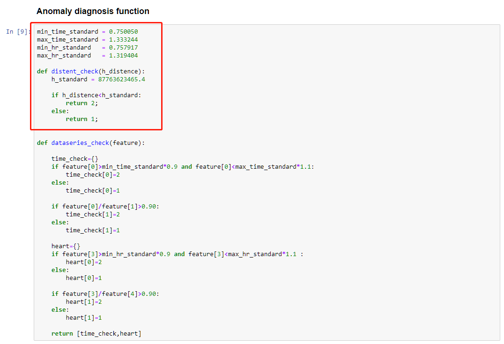

## Heartbeat_Anomaly_Diagnosis

#### **The** **Structure** **of** **Project** Directory 

The purpose of this project is to analyze the heart rate sequence of each thread generated by multi-threaded OpenMP applications and perform anomaly diagnosis. The project directory is shown below. In this experiment, three types of OpenMP benchmark suites such as NPB, Jacobi, and EPCC, are used as the testbed to generate heartbeats. 

For a better understanding of our framework proposed, this project creates a folder for each benchmark application. In this folder, there are two folds *i.e*., training and testing tasks. Besides, the dataset is created for the paper evaluation. 


<pre>
Heartbeat_Anomaly_Diagnosis
│
├── NPB_cg
│   ├── training
│   │   └── Normal_parameters_training.ipynb
│   └── testing
│       └── NPB_cg_Test.ipynb
├── NPB-bt
│   └── testing
├── NPB-cg
│   └── testing
├── NPB-lu
│   └── testing
├── EPCC-array
│   └── testing
├── jacobi
│   └── testing
├── Dataset
└── readme.md
</pre>


#### Operating Environment

**System Environment**

| Attributes       | value        |
| ---------------- | ------------ |
| Operating system | Ubuntu 16.04 |
|Processor|Standard S2.LARGE8 v4 CPU|
|RAM|8G|

**Note**:  To control the primary parameters, only make the corresponding exception programs with the heartbeat APIs get started. During the experiment, you should not start other additional programs *e.g*., browsers and application software to avoid competition for system resources. 

**Preconditions**

```
Python 3.6.4
Anaconda 4.4.0
Jupyter 4.4.0
Numpy 1.14.0
Pandas 0.22.0
```


#### Execute Program

**Basic Process**

* Open terminal or cmd to enter the code path

```python
cd ./path
```

* Enter jupyter notebook

```python
jupyter notebook
```

* Click on the .ipynb file and enter to view and execute the program in real time with "Ctrl+Enter"


#### DataSet

**Basic information**

| File name                        | Description                                  |
| -------------------------------- | -------------------------------------------- |
| sp\|lu\|cg\|bt_lab_abnormal.xlsx | Heartbeat sequence set marked as memory leak |
| sp\|lu\|cg\|bt_lab_shutdown.xlsx | Heartbeat sequence set marked as shutdown    |
| sp\|lu\|cg\|bt_lab_normal.xlsx   | Heartbeat sequence set marked as normal      |
| sp\|lu\|cg\|bt_normal.xlsx       | Heartbeat sequence set for training          |

**File attributes**

| Attributes | Description                                         |
| ---------- | --------------------------------------------------- |
| index      | index                                               |
| thread_num | Thread number                                       |
| iter       | Number of iterations                                |
| time       | Execution time                                      |
| heartrate  | Thread heart rate                                   |
| score      | Mark <br/> (0: normal, 1: memory leak, 2: Shutdown) |
| file       | File identification                                 |


#### Example

The example uses the NPB-cg benchmark dataset as an example to introduce the implementation process of this project.

**Training**

First, enter the path ```./NPB-cg/training``` through the ```cd``` instruction in the Linux operating system. 

Second, check whether the training data ```cg_std_normal_1.xlsx``` is in the current path, and enter the jupyter file ```Normal_parameters_training.ipynb```.

Then, execute all the code in the jupyter environment, as shown in the figure below, click the Run button.


Finally, obtain the training parameters of each feature of the model.


**Testing**

The same as training, firstly, enter the path ```./NPB-cg/testing``` through the ```cd``` instruction in the Linux operating system. 

Then, check whether the training data ```cg_std_abs.xlsx```,```cg_std_normal.xlsx and``` and ```cg_std_shut.xlsx``` is in the current path, and enter the jupyter file ```NPB_cg_Test.ipynb```.

After that, the parameters in the original program are replaced by those obtained in the training process as shown in the box of the figure below. Note that to ensure the accuracy and stability of the program, some abnormal parameters will be fine-tuned furthermore.



Finally, the program obtains the results of each thread of the NPB-cg.


